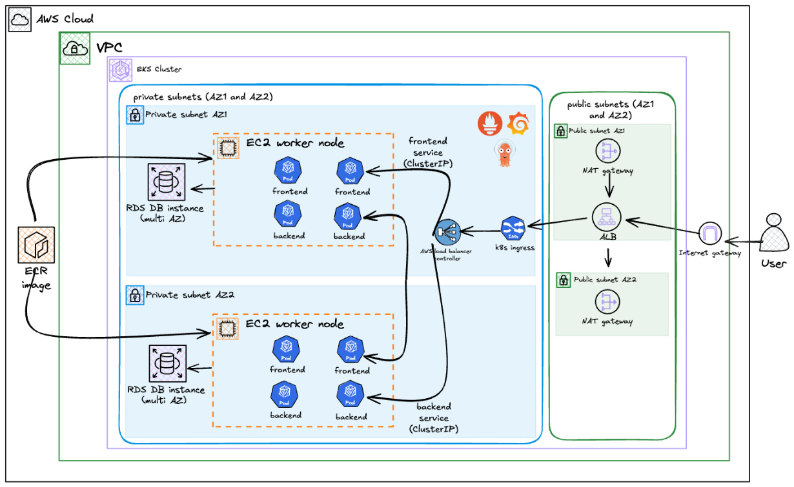

# 3-Tier EKS Application

A production-grade three-tier application (React frontend, Flask backend, PostgreSQL database) deployed on AWS EKS using Terraform and GitOps with ArgoCD.

[Detailed Blog Post](https://wegoagain.dev/blog/3-tier-eks-microservices)

## Quick Start

### Prerequisites
- AWS CLI, kubectl, Terraform, Docker
- AWS account with appropriate permissions

### Deploy to AWS

```bash
# 1. Clone and setup
git clone https://github.com/wegoagain-dev/3-tier-eks.git
cd 3-tier-eks

# 2. Update terraform/provider.tf with your S3 bucket for state
# Or comment out the backend block for local state

# 3. Deploy infrastructure (15-20 min)
cd terraform
terraform init
terraform apply

# 4. Configure kubectl
aws eks update-kubeconfig --name devops-quiz --region eu-west-2

# 5. Bootstrap GitOps (single command)
kubectl apply -f k8s/platform/root.yaml
```

**That's it!** ArgoCD will automatically deploy:
- Platform tools (ALB Controller, External Secrets Operator, Prometheus)
- Application (backend, frontend, database migrations)

### Verify Deployment

```bash
# Watch applications sync
kubectl get applications -n argocd

# Get the ALB URL
kubectl get ingress -n 3-tier-app-eks

# Access ArgoCD UI
kubectl -n argocd get secret argocd-initial-admin-secret -o jsonpath="{.data.password}" | base64 -d
kubectl port-forward svc/argocd-server -n argocd 9000:443
# Open https://localhost:9000
```

### Deploy Changes

Just `git push`! GitHub Actions builds images, updates manifests, and ArgoCD syncs automatically.

## Architecture



**Key Features:**
- **Infrastructure**: VPC (3-tier subnets), EKS (managed node groups), RDS
- **GitOps**: ArgoCD with App of Apps pattern and sync waves
- **Security**: OIDC (GitHub Actions), IRSA (pod IAM), External Secrets Operator
- **CI/CD**: GitHub Actions → ECR → ArgoCD auto-sync
- **Monitoring**: Prometheus/Grafana

## Project Structure

```
├── terraform/           # Infrastructure (VPC, EKS, RDS, IAM)
├── k8s/
│   ├── platform/       # ArgoCD apps for platform tools
│   │   └── root.yaml   # Bootstrap: kubectl apply -f this
│   └── apps/           # Application workloads
├── frontend/           # React app
├── backend/            # Flask API
└── .github/workflows/  # CI/CD pipeline
```

## Local Development

```bash
# Docker Compose (easiest)
docker compose up --build -d
# Frontend: http://localhost:8080
# Backend: http://localhost:8000/api

# Or Kind (Kubernetes locally)
kind create cluster --name three-tier --config kind-config.yaml
# See README for full Kind instructions
```

## Cleanup

```bash
# Delete ingress first (cleans up ALB)
kubectl delete ingress three-tier-ingress -n 3-tier-app-eks

# Destroy everything
cd terraform && terraform destroy
```

## Cost

~$190/month (eu-west-2): EKS ($73) + EC2 ($60) + RDS ($13) + NAT ($32) + ALB ($16)

## Troubleshooting

| Issue | Solution |
|-------|----------|
| Ingress stuck (no ADDRESS) | Wait for ALB Controller pod: `kubectl get pods -n kube-system \| grep aws-load-balancer` |
| Secrets not syncing | Check ESO: `kubectl get externalsecrets -n 3-tier-app-eks` |
| Frontend connection error | Verify ALB DNS and `/api` routing |
| Migration job fails | Check logs: `kubectl logs -n 3-tier-app-eks -l job-name=database-migration` |

## What I Learned

- **App of Apps + sync waves**: Clean GitOps with guaranteed deployment order
- **IRSA**: Pods assume IAM roles via OIDC - no node-level permissions
- **External Secrets**: AWS Secrets Manager → Kubernetes, no secrets in Git/state
- **Separate concerns**: Terraform = infrastructure, kubectl = bootstrap, ArgoCD = everything else

## Roadmap

- [ ] Route 53 + SSL certificates
- [ ] Horizontal Pod Autoscaling
- [ ] Network Policies
- [ ] Multi-AZ RDS
