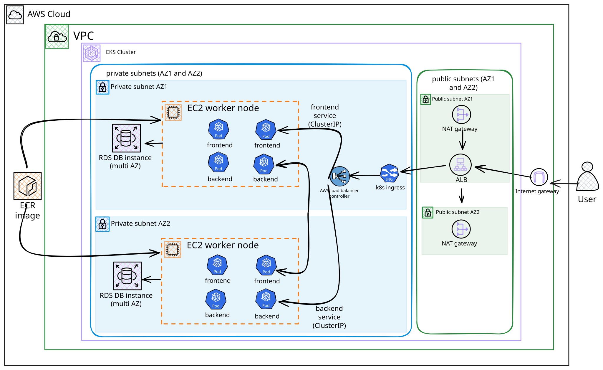
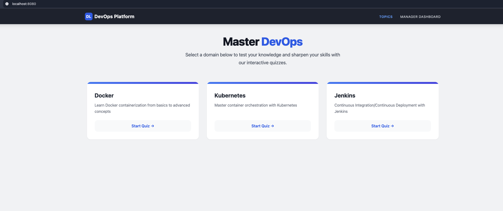
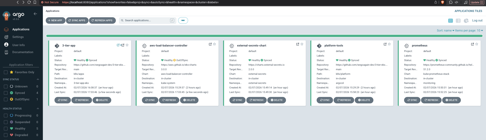

# Production Grade Three-Tier App on AWS EKS (EC2, RDS, ECR, ALB, IAM, Route53), GitOps (ArgoCD), Prometheus, Grafana, Github Actions

## Overview
This project deploys a three-tier application on AWS EKS using a highly available, production-grade architecture spanning multiple availability zones. The application consists of a React frontend, Flask backend and a RDS PostgreSQL database. It demonstrates end-to-end DevOps practices with containerisation, CI/CD automation, and GitOps deployment with ArgoCD.

The app is a DevOps related quiz application where users can take quizzes on various DevOps topics, you can also add your own `.csv` files to make your custom quizzes.

I have a detailed guide on how to deploy this application on AWS EKS on my blog [here](https://wegoagain.dev/blog/3-tier-eks-microservices).

## Key Features
- **Infrastructure as Code (Terraform):** Fully automated infrastructure setup including RDS, OIDC, and Kubernetes resources.
- **Highly Available EKS:** Distributed across multiple AZs.
- **GitOps (ArgoCD):** Automated deployment pipeline.
- **CI/CD (GitHub Actions):** Automated build and push to ECR.
- **Observability:** Integrated Prometheus and Grafana.
- **Security:** Secrets management, OIDC authentication, and IAM least privilege.

## Architecture 
 

## CI/CD and GitOps Workflow
 

## Screenshots
 
DevOps quiz app demo with quizzes with multiple choice questions.

 
ArgoCD dashboard showing application status and logs.

 
Grafana dashboard showing CPU/Memory usage and utilisation for the application.

## How to Run

### Option 1: Run Locally (Docker Compose)
The most efficient way to run the entire stack locally is using **Docker Compose**. This will start the database, run migrations, and launch both the backend and frontend.

```bash
# Clone the repository
git clone https://github.com/wegoagain-dev/3-tier-eks.git
cd 3-tier-eks

# Start the entire stack
docker compose up --build
```

Once started:
- **Frontend:** [http://localhost:8080](http://localhost:8080)
- **Backend API:** [http://localhost:8000/api](http://localhost:8000/api)

### Option 2: Deploy to AWS (GitOps with ArgoCD)
For the full production deployment on AWS, check out the detailed guide [here](https://wegoagain.dev/blog/3-tier-eks-microservices).

**GitOps Workflow:**
1. **Provision Cluster**:
   ```bash
   eksctl create cluster -f cluster-config.yaml
   ```

2. **Deploy Infrastructure & ArgoCD**:
   ```bash
   cd terraform
   terraform init
   terraform apply
   ```
   *Creates RDS, Namespace, Secrets, and installs ArgoCD.*

3. **Automatic Deployment**:
   ArgoCD will automatically sync the `k8s/` directory to your cluster.
   
   **Access ArgoCD UI:**
   ```bash
   # Get password
   kubectl -n argocd get secret argocd-initial-admin-secret -o jsonpath="{.data.password}" | base64 -d; echo
   
   # Port-forward
   kubectl port-forward svc/argocd-server -n argocd 8080:443
   ```
   Open [https://localhost:8080](https://localhost:8080)

   **To Deploy Changes:**
   Just `git push`! ArgoCD watches the repo and updates the cluster automatically.

### Option 3: Kubernetes (Kind)
You can also run the full Kubernetes stack locally using `kind`.

1. **Create the Cluster:**
   ```bash
   kind create cluster --name devops-lab --config kind-config.yaml
   ```

2. **Build Container Images:**
   
   **Using Docker:**
   ```bash
   docker build -t 3-tier-eks-backend:latest ./backend
   docker build -t 3-tier-eks-frontend:latest ./frontend
   ```
   
   **Using Podman:**
   ```bash
   podman build -t 3-tier-eks-backend:latest ./backend
   podman build -t 3-tier-eks-frontend:latest ./frontend
   ```

3. **Load Images into Kind:**
   
   **Using Docker:**
   ```bash
   kind load docker-image 3-tier-eks-backend:latest --name devops-lab
   kind load docker-image 3-tier-eks-frontend:latest --name devops-lab
   ```
   
   **Using Podman:**
   ```bash
   # Tag images for kind
   podman tag localhost/3-tier-eks-backend:latest 3-tier-eks-backend:latest
   podman tag localhost/3-tier-eks-frontend:latest 3-tier-eks-frontend:latest
   
   # Save and load into kind
   podman save -o /tmp/backend.tar localhost/3-tier-eks-backend:latest
   podman save -o /tmp/frontend.tar localhost/3-tier-eks-frontend:latest
   kind load image-archive /tmp/backend.tar --name devops-lab
   kind load image-archive /tmp/frontend.tar --name devops-lab
   ```

4. **Create Secrets:**
   ```bash
   # Copy the example file and update if needed
   cp .env.k8s.example .env.k8s
   
   # Create the secret from the env file
   kubectl create secret generic database-secret \
     --from-env-file=.env.k8s \
     --namespace 3-tier-app-eks
   ```

5. **Apply Manifests:**
   ```bash
   # Apply Namespace and ConfigMaps
   kubectl apply -f k8s-local/namespace.yaml
   kubectl apply -f k8s-local/configmap.yaml
   kubectl apply -f k8s-local/postgres.yaml
   
   # Wait for the database to be ready, then apply the rest
   kubectl wait --namespace 3-tier-app-eks \
     --for=condition=ready pod \
     --selector=app=postgres \
     --timeout=90s

   kubectl apply -f k8s-local/
   ```

6. **Access the Application:**
   Since we aren't using an Ingress Controller locally, use port-forwarding:

   ```bash
   # Frontend (Access at http://localhost:8080)
   kubectl port-forward svc/frontend -n 3-tier-app-eks 8080:80

   # Backend (Access at http://localhost:8000)
   kubectl port-forward svc/backend -n 3-tier-app-eks 8000:8000
   ```

## Troubleshooting

### Kind + Podman Issues
- **Image not found**: Make sure to use the `localhost/` prefix when tagging images with podman
- **Permission denied**: Run podman commands without sudo, or configure podman for rootless mode

### Migration Job Failures
- Check logs: `kubectl logs -n 3-tier-app-eks -l job-name=database-migration`
- Verify database is ready: `kubectl get pods -n 3-tier-app-eks -l app=postgres`
- Check secrets: `kubectl get secret database-secret -n 3-tier-app-eks -o yaml`

## What's Coming Next
- Route 53 for custom domain management
